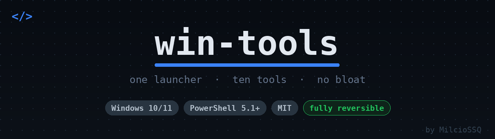
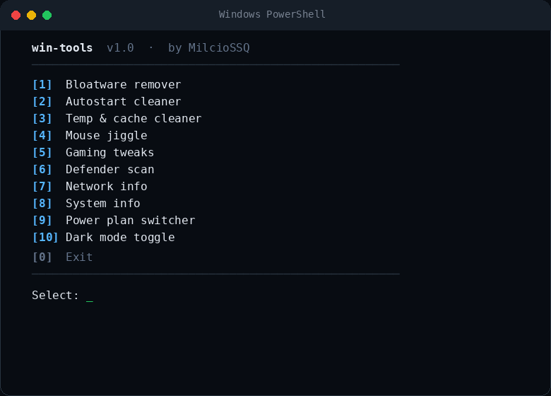
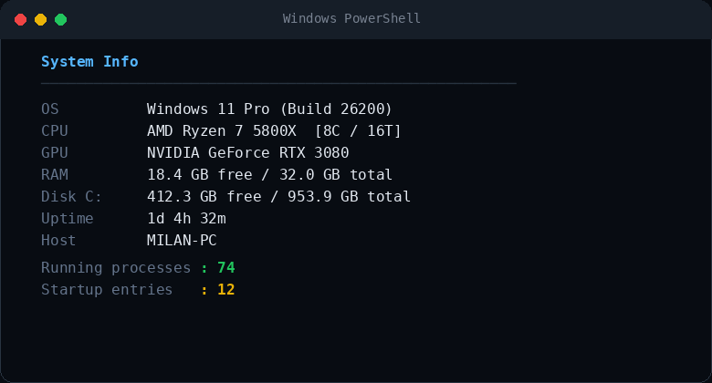
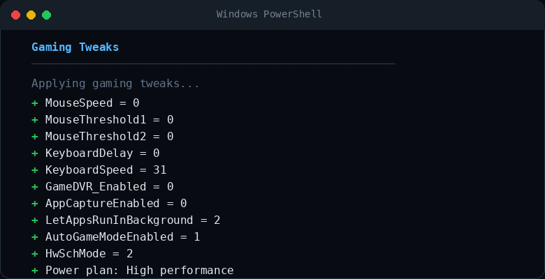
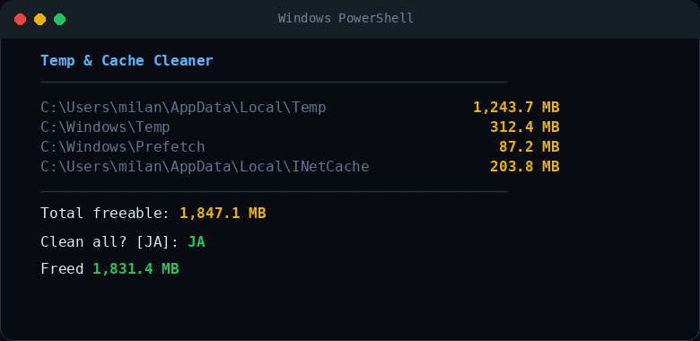

<p align="center">
  
</p>

# win-tools

A personal Windows utility kit — one launcher, ten tools, no bloat.


--- 

## Tools

| # | Tool | What it does |
|---|------|-------------|
| 1 | **Bloatware remover** | Removes pre-installed UWP junk (News, Bing Weather, Skype, TikTok, …) |
| 2 | **Autostart cleaner** | Lists and disables unnecessary startup entries; protects drivers and audio |
| 3 | **Temp & cache cleaner** | Clears `%TEMP%`, Windows Temp, Prefetch, browser cache, pip cache |
| 4 | **Mouse jiggle** | Moves the mouse ±1 px every 5 minutes to prevent sleep / screensaver |
| 5 | **Gaming tweaks** | Mouse acceleration off, Game DVR off, GPU scheduling, MMCSS, power plan |
| 6 | **Defender scan** | Update signatures + quick / full / offline scan from one menu |
| 7 | **Network info** | Local IPs, gateway, DNS, MAC, public IP, ping target |
| 8 | **System info** | OS, CPU, GPU, RAM, disk, uptime, process count |
| 9 | **Power plan switcher** | Switch between Balanced, High performance, and Power saver |
| 10 | **Dark mode toggle** | Switch Windows dark / light mode without opening Settings |

---

## Screenshots

<details open>
<summary><b>Main menu</b></summary>



</details>

<details>
<summary><b>System info</b></summary>



</details>

<details>
<summary><b>Gaming tweaks</b></summary>



</details>

<details>
<summary><b>Temp & cache cleaner</b></summary>



</details>

---

## Usage

```powershell
powershell -ExecutionPolicy Bypass -File .\win-tools.ps1
```

Or run any tool standalone:

```powershell
powershell -ExecutionPolicy Bypass -File .\tools\sysinfo.ps1
powershell -ExecutionPolicy Bypass -File .\tools\cleaner.ps1
```

The launcher elevates itself automatically — just approve the UAC prompt.

---

## Structure

```
win-tools/
├── win-tools.ps1        # main launcher / menu
├── tools/
│   ├── bloatware.ps1
│   ├── autostart.ps1
│   ├── cleaner.ps1
│   ├── jiggle.ps1
│   ├── gaming.ps1
│   ├── defender.ps1
│   ├── network.ps1
│   ├── sysinfo.ps1
│   ├── powerplan.ps1
│   └── darkmode.ps1
├── screenshots/
├── LICENSE
└── README.md
```

---

## Notes

- All changes made by **gaming tweaks** and **autostart cleaner** are reversible — backups are stored in `%LOCALAPPDATA%`.
- **Bloatware remover** only targets known junk. Xbox, Store, and your drivers are never touched.
- **Mouse jiggle** runs until you close the window or press Ctrl+C.

## License

[MIT](LICENSE) © MilcioSSQ
