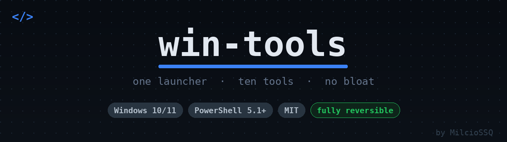
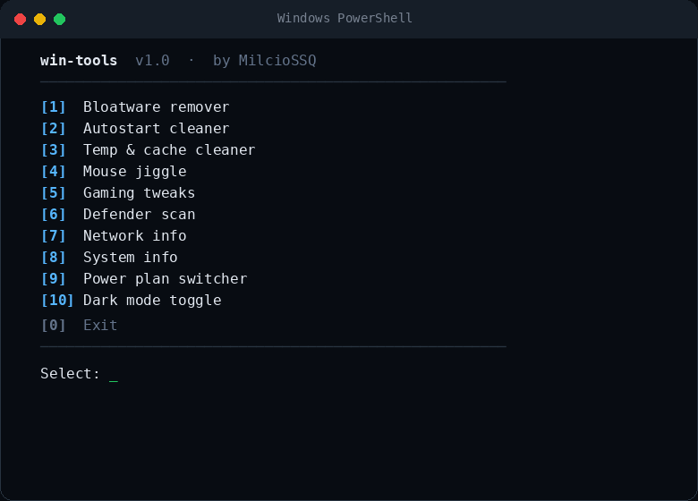
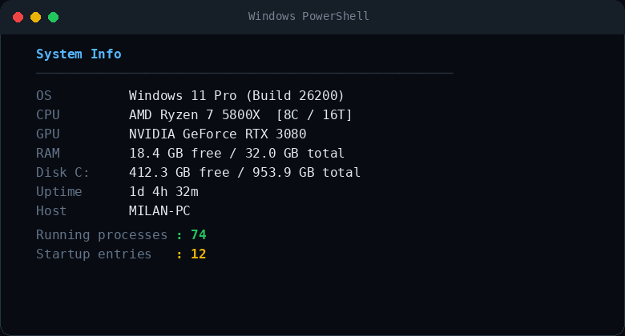
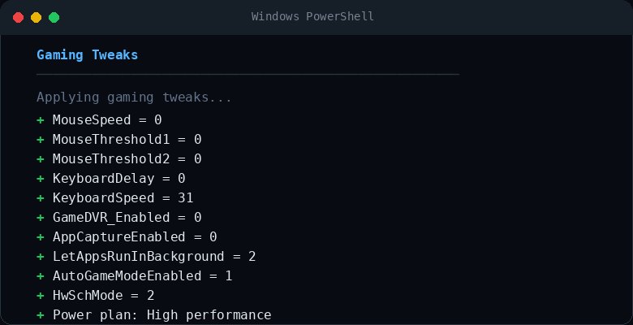
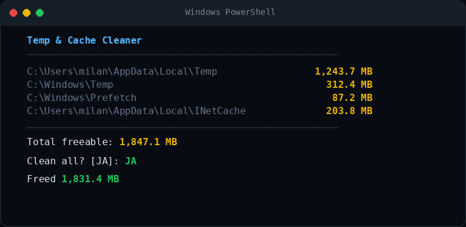

<div align="center">
  
</div>

<div align="center">

# 🛠️ win-tools

**A personal Windows utility kit — one launcher, ten tools, no bloat.**


</div>

---

## ⚡ How to Use

**1.** Download this repo (green `Code` button → `Download ZIP`) and extract it.

**2.** Open **PowerShell as Administrator**.

**3.** Navigate to the folder and run the script:

```powershell
cd ~\Downloads\win-tools-main
.\win-tools.ps1
```

**4.** Pick a tool from the menu — done!

> If PowerShell blocks the script, run this first:
> ```powershell
> Set-ExecutionPolicy Bypass -Scope Process
> ```

---

## 🧰 Tools

| # | Tool | What it does |
|---|------|-------------|
| 1 | **Bloatware Remover** | Removes pre-installed UWP junk (News, Bing Weather, Skype, TikTok, …) |
| 2 | **Autostart Cleaner** | Lists and disables unnecessary startup entries; protects drivers and audio |
| 3 | **Temp & Cache Cleaner** | Clears `%TEMP%`, Windows Temp, Prefetch, browser cache, pip cache |
| 4 | **Mouse Jiggle** | Moves the mouse ±1 px every 5 min to prevent sleep / screensaver |
| 5 | **Gaming Tweaks** | Mouse acceleration off, Game DVR off, GPU scheduling, MMCSS, power plan |
| 6 | **Defender Scan** | Update signatures + quick / full / offline scan from one menu |
| 7 | **Network Info** | Local IPs, gateway, DNS, MAC, public IP, ping target |
| 8 | **System Info** | OS, CPU, GPU, RAM, disk, uptime, process count |
| 9 | **Power Plan Switcher** | Switch between Balanced, High Performance, and Power Saver |
| 10 | **Dark Mode Toggle** | Switch Windows dark / light mode without opening Settings |

---

## 📸 Screenshots

<details open>
<summary><b>Main Menu</b></summary>
<br/>
<div align="center">
  
</div>
</details>

<details>
<summary><b>System Info</b></summary>
<br/>
<div align="center">
  
</div>
</details>

<details>
<summary><b>Gaming Tweaks</b></summary>
<br/>
<div align="center">
  
</div>
</details>

<details>
<summary><b>Temp & Cache Cleaner</b></summary>
<br/>
<div align="center">
  
</div>
</details>

---

## 💻 Run a Single Tool

You can also run any tool standalone without the menu:

```powershell
.\tools\sysinfo.ps1
.\tools\cleaner.ps1
.\tools\gaming.ps1
```

---

## 📂 Structure

```
win-tools/
├── win-tools.ps1        # main launcher / menu
├── tools/
│   ├── bloatware.ps1
│   ├── autostart.ps1
│   ├── cleaner.ps1
│   ├── jiggle.ps1
│   ├── gaming.ps1
│   ├── defender.ps1
│   ├── network.ps1
│   ├── sysinfo.ps1
│   ├── powerplan.ps1
│   └── darkmode.ps1
├── screenshots/
├── LICENSE
└── README.md
```

---

## 📝 Notes

- All changes made by **Gaming Tweaks** and **Autostart Cleaner** are reversible — backups are stored in `%LOCALAPPDATA%`.
- **Bloatware Remover** only targets known junk. Xbox, Store, and your drivers are never touched.
- **Mouse Jiggle** runs until you close the window or press `Ctrl+C`.

---

<div align="center">

## 🤝 Contributing

Issues and pull requests are welcome!

---


[MIT](LICENSE) © MilcioSSQ

</div>
